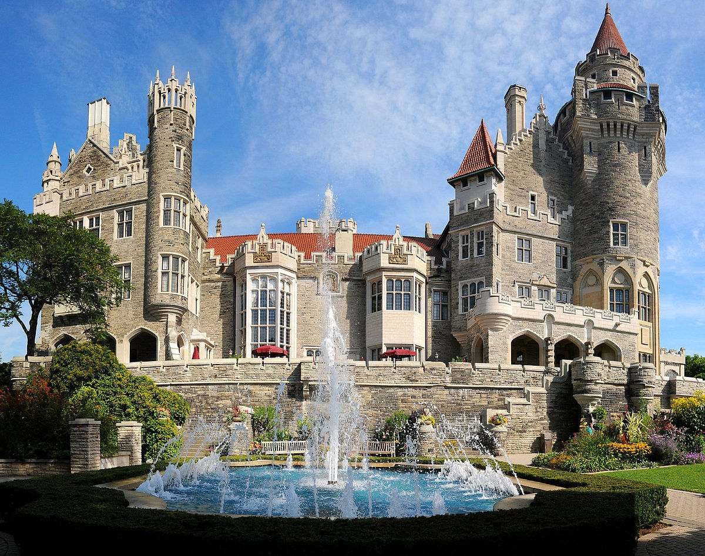
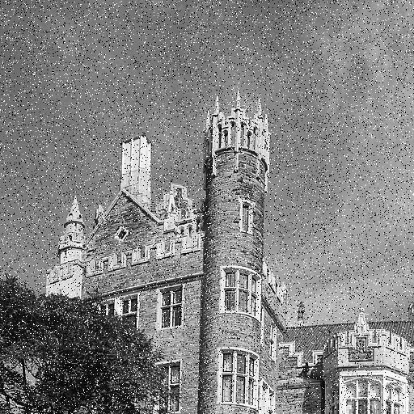
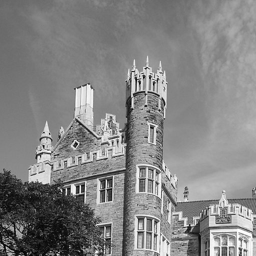
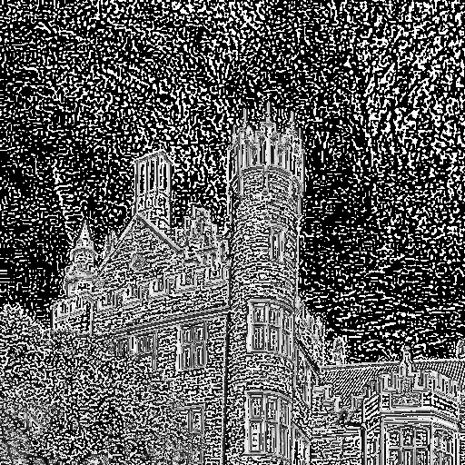
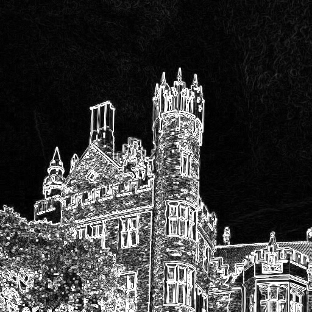
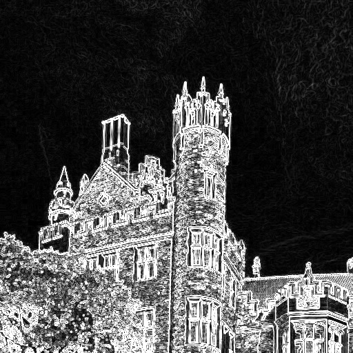

# ImageFournier
Image Fournier Transform with multiple different methods

## Original Image

### Noise Generation

### High Pass filter Cropped Grayscale

### Laplacian of Gaussian Filter

### Denoised Salt & Pepper

### Edge Detection with Sobel and Prewitt

